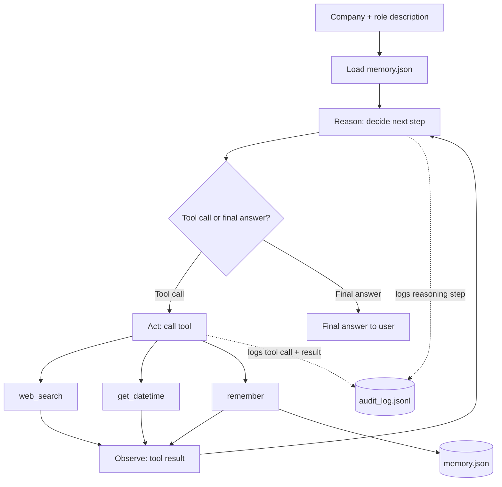

# Day-in-the-Life Research Agent

A command-line agent that researches a company and role, then writes a realistic day-to-day workflow for that job.

Built around the core pieces of an agentic system: a loop that decides when to act, tool use, guardrails, context and memory, and an audit trail.

## How it works



Every step also has a hard cap (`MAX_STEPS`), so the loop always terminates even if the model keeps requesting tools.

## Setup

```bash
uv add openai python-dotenv tavily-python
cp .env.example .env   # then add your keys
```

- OpenRouter key: [openrouter.ai/keys](https://openrouter.ai/keys)
- Tavily key: [tavily.com](https://tavily.com) (free tier is enough)

## Usage

```bash
uv run main.py
```

Paste a company name and job description — blank lines are fine — then type `END` on its own line to submit. Type `exit` to quit.

```
you: Company: Acme Corp
Role: Senior Backend Engineer
...paste the rest of the posting...
END
```

Ask follow-ups in the same session; the agent keeps context and only re-searches when the question is genuinely new.

## Components

| Piece       | What it does                                                                                 |
| ----------- | -------------------------------------------------------------------------------------------- |
| Agent loop  | Loops until the model gives a final answer or hits `MAX_STEPS`                               |
| Tools       | `web_search` (Tavily), `get_datetime`, `remember` — model decides when to call each          |
| Guardrails  | Input/output length limits, step-budget awareness, tool errors contained instead of crashing |
| Memory      | `remember` writes durable facts to `memory.json`, reloaded into every session                |
| Audit trail | Every prompt, response, tool call, result, and error logged to `audit_log.jsonl`             |

## Files

- `main.py` — the agent
- `memory.json` — durable facts (created on first `remember` call)
- `audit_log.jsonl` — audit trail (created on first run)
- `sample_audit_log.jsonl` — example of a full research session
- `.env` — API keys (not committed)
